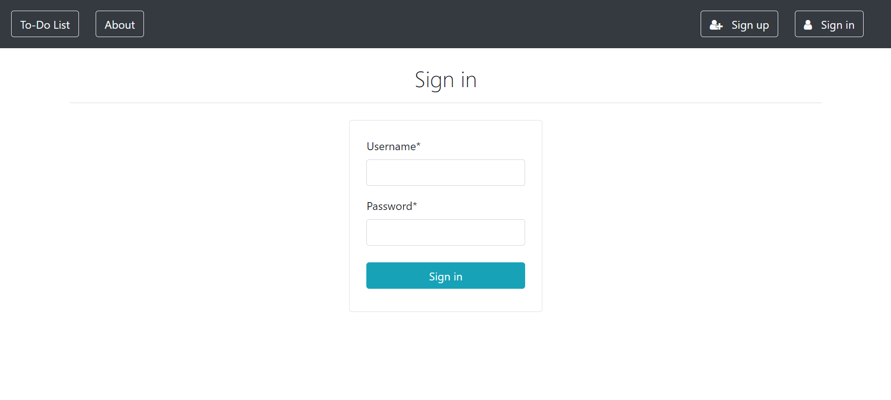
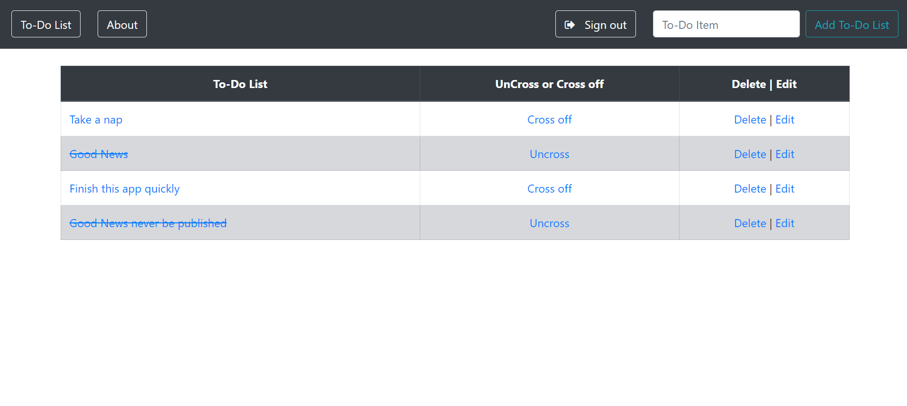
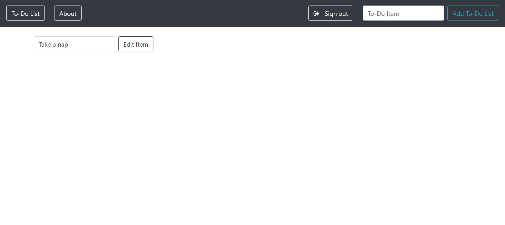

# To-Do-List-Web Application
*A simple to-do list webapp based on Python and Django. It uses Bootstrap for front end components.*

# Features
* User can add his/her daily task.
* Can completed the task.
* Authentication.
* User-friendly.

# Tools
## Front-end Part
* HTML
* CSS
* Bootstrap
## Back-end
* Django
* SQLite 3

# Screenshots of the Project

  
  
  

**Copyright ©** 2019-3019 Md. Omar Faruk

## Go Through This Site Then You Will Know About This Site Properly.
